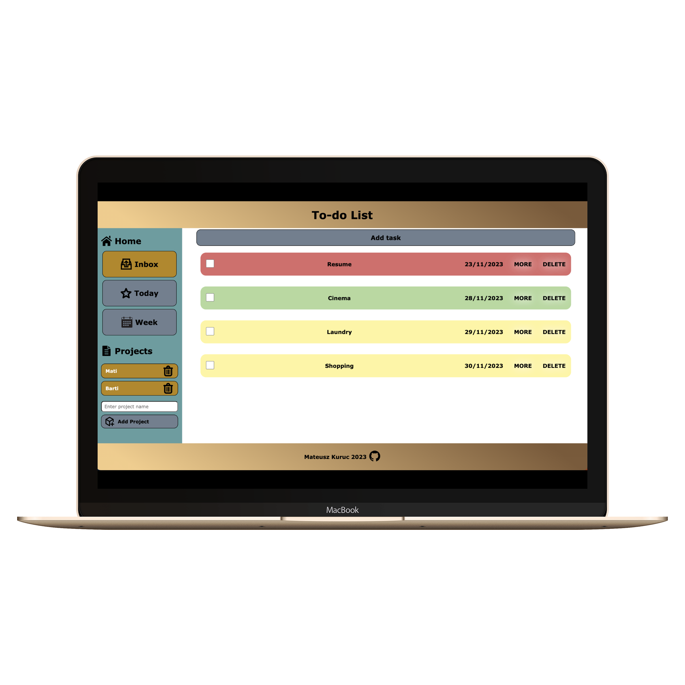

# odin-todo-list
To-do list app built with JavaScript, HTML and CSS.

🌐 [To-do list app live](https://mateuszkuruc.github.io/odin-todo-list/)
<h2>Goals</h2>

The aim is to create an app that will allow the user to create separate projects and assign individual task ('todo' items) to them.

The app has got the option to set 'due date' for each item and provide them with basic details like title, description or priority. To allow date management the date-fns library was used.

All the tasks created by user are saved to local storage, which allows them to come back to their task at a later date (provided that they use the same device and browser). This is the first time that I decided to introduce local storage and it made me learn more about how data is passed in web apps.

<h2>Key features</h2>
<ul>
  <li>Add, update and delete to-do tasks</li>
  <li>Set due date for tasks</li>
  <li>Sort tasks by date and priority</li>
  <li>Use local storage to save data</li>
  <li>Create separate projects for each of them to contain individual set of to-do lists</li>
</ul>

<h2>Visual representation</h2>

In case of any questions, feel free to contact me directly.
